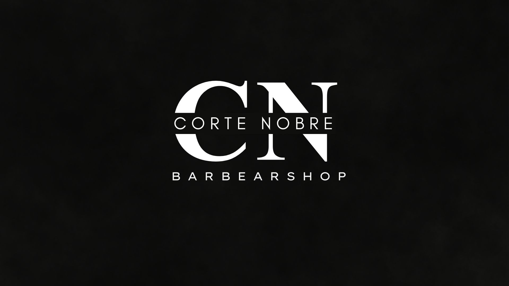

# Barbearia Corte Nobre

## Descrição

A **Barbearia Corte Nobre** é um projeto dedicado à arte da barbearia, um projeto feito para a barbearia do bairro onde moro, combinando tradição e modernidade. A barbearia oferece serviços de corte de cabelo, barba e cuidados com a pele.
O seu objetivo é proporcionar uma experiência única aos clientes, com profissionais qualificados e produtos de alta qualidade.

Todas as imagens e links utilizados neste projetos são fictícios, as imagens, nomes e links reais foram atreladas ao projeto do cliente final, este projeto foi reaproveitado para estudos acadêmicos. 

## Funcionalidades

- Formulário de contato
- Catálogo de estilos de corte e barba
- Dicas de cuidados com a pele e barba
- Avaliações de clientes
- tabela de preços

## Páginas
- Página inicial
- Orçamento
- Sobre
- Galeria
- contato
- Agradecimento

## Tecnologias Utilizadas

- HTML, CSS e JavaScript para o site
- Planilha do google Docs integrada com o formulário
- Figma para o Design do site

## Imagens do site

Página Inicial do site:

##
Página de Galeria:

##
Página dos Preços:

##
Página de Contatos:

## Veja o Deploy do Projeto

 

Veja você mesmo, Experimente o site [Clicando Aqui!](https://barbearia-corte-nobre.vercel.app/index.html)

 

## Como Contribuir

1. Faça um fork deste repositório
2. Crie uma branch com sua funcionalidade: `git checkout -b minha-funcionalidade`
3. Faça as alterações necessárias
4. Envie um pull request

## Contato

Para mais informações, entre em contato conosco pelo email: lamoni_lr@hotmail.com

## Licença
Este projeto está licenciado sob a Licença MIT.

